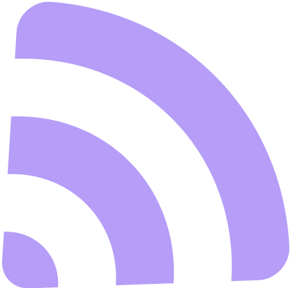

# Konnect

<div align="center">



**Будущее за нами**

[](https://www.apple.com/ios/)
[](https://swift.org/)
[]()

</div>

---

## Функциональность

### Основные возможности

- **Музыкальный плеер**
  - Полнофункциональный плеер с поддержкой фонового воспроизведения
  - Управление с экрана блокировки и Control Center
  - Чарты популярных треков
  - Поиск музыки
  - "Мой Вайб" - персонализированные рекомендации

- **Посты и лента**
  - Создание постов с текстом, изображениями и музыкой
  - Лента с постами друзей и популярным контентом
  - Лайки, репосты и комментарии
  - Просмотр изображений с жестами (зум, свайп)

- **Профили**
  - Персонализация профиля с фоном и аватаром
  - Статистика подписчиков и подписок
  - Просмотр постов пользователя
  - Система подписок

- **Уведомления**
  - Реальные уведомления о лайках, комментариях и подписках
  - Автоматическая проверка новых уведомлений каждые 30 секунд
  - Нативные iOS уведомления

- **Темы**
  - 5 красивых тем оформления
  - Базовый (фиолетовый), Амолед, Зеленый, Синий, Голубой
  - Динамические акцентные цвета из профиля

- **Кеширование**
  - Кеширование треков для офлайн прослушивания
  - Кеширование изображений и аватарок
  - Управление кешем с детальной статистикой

- **Deep Linking**
  - Открытие профилей, постов и музыки по ссылкам
  - Поддержка доменов k-connect.ru

---

## Установка

### Через Sideloadly (рекомендуется)

1. **Скачайте последний релиз**
   - Перейдите в раздел [Releases](https://github.com/c1osed1/konnectapp/releases)
   - Скачайте файл `konnectapp.ipa`

2. **Установите Sideloadly**
   - Скачайте с [официального сайта](https://sideloadly.io/)
   - Установите на ваш Mac или Windows

3. **Установите приложение**
   - Откройте Sideloadly
   - Перетащите файл `konnectapp.ipa` в окно
   - Подключите iPhone через USB
   - Введите Apple ID (для подписи)
   - Нажмите "Start"

4. **Доверие разработчику**
   - На iPhone: Настройки → Основные → Управление устройством
   - Найдите ваш Apple ID и нажмите "Доверять"

### Через Xcode (для разработчиков)

```bash
# Клонируйте репозиторий
git clone https://github.com/c1osed1/konnectapp.git
cd konnectapp

# Откройте проект
open konnectapp.xcodeproj

# Выберите "Any iOS Device" и соберите
# Product → Build (⌘B)
```

---

## Релизы

Все релизы доступны в разделе [Releases](https://github.com/c1osed1/konnectapp/releases).

Каждый релиз содержит:
- **konnectapp.ipa** - готовый к установке файл
- **Release Notes** - список изменений
- **Версия** - номер версии приложения

### Текущая версия: 1.2.5

---

## Технологии

- **SwiftUI** - современный UI фреймворк
- **AVFoundation** - воспроизведение музыки
- **Combine** - реактивное программирование
- **URLSession** - сетевые запросы
- **Keychain** - безопасное хранение токенов
- **UserDefaults** - локальное хранилище


## Темы

Приложение поддерживает 5 тем оформления:

- **Базовый** - фиолетовая тема (по умолчанию)
- **Амолед** - темная тема с прозрачностью
- **Зеленый** - зеленая тема
- **Синий** - синяя тема
- **Голубой** - голубая тема

---

## Требования

- iOS 18.0 или новее
- iPhone или iPad
- Аккаунт на [k-connect.ru](https://k-connect.ru)

---

## Разработчик

**qsoul**

- Email: verif@k-connect.ru
- Версия: 1.2.5

<div align="center">

**Сделано для сообщества K-Connect**

[Сайт](https://k-connect.ru) • [Поддержка](mailto:verif@k-connect.ru)

</div>
